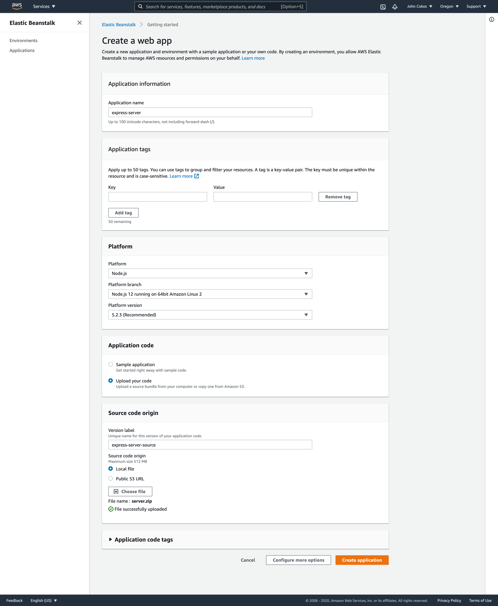

# AWS: Cloud Servers

"The Cloud" is at the core of most internet applications, from distributed data, to servers, to games and hosting services like Heroku. How does it work? How can we leverage it?

## Learning Objectives

### Students will be able to

#### Describe and Define

- "The Cloud"
- "Containers"
- Virtual Server "Instances"
- CDNs and scaling horizontally

#### Execute

Use "Elastic Beanstalk" to Deploy a NodeJS server to an EC2 instance at AWS

This requires 2 parts:

1. An "Environment" (container) for our application to run in
1. The application code itself to be deployed "into" the environment

## Today's Outline

<!-- To Be Completed By Instructor -->

## Notes

Elastic Beanstalk (EB) will automatically wire up essential AWS services to create and deploy a running application.

For Node.js applications, this is generally just going to be an EC2 server instance along with an S3 bucket that stores our files

There are 2 ways to create a new application with EB, detailed below. Either way, all of your environments and applications will be available in the AWS Developer Console (GUI) for you to manage

### Creating an application with the Elastic Beanstalk GUI

- Choose NodeJS as your platform
- Create and upload a .zip file with your application source code
  - Do not include `node_modules` or `package-lock.json`

This will create your application and environment in one step, giving you a full GUI from where you can manage the app

### Creating an application using the command line only

First, ensure that you've installed the [AWS CLI](https://docs.aws.amazon.com/cli/latest/userguide/cli-chap-install.html) and the [aws eb](https://docs.aws.amazon.com/elasticbeanstalk/latest/dg/eb-cli3-install.html) command line utilities.

1. `eb init` - Initializes your folder as an Elastic Beanstalk application
   - Choose your region (`us-west-2`)
   - Choose `[Create new Application]`
     - Note: If you already have an application, you could also choose that to connect
   - Answer the other questions as appropriate
     - Choose Node.js at the correct version
1. `eb create my-environment-name` - Create an "environment" for your app to reside in
1. `eb deploy` to deploy your new application to your new environment
   - You'll also use this whenever you make code changes

You can then use some other `eb` commands to manage your apps

- `eb open` to open your app in the browser
- `eb list` to get a list of apps
- `eb ssh` to ssh (login) to one of your apps
- `eb health` to get a health check on  your environments

### Auto-Deploy

You can also use GitHub Actions to auto-deploy your source code to your EB Environment whenever you check in your code.

> Browse the GitHub Marketplace for actions you can import into your repo. There are many
